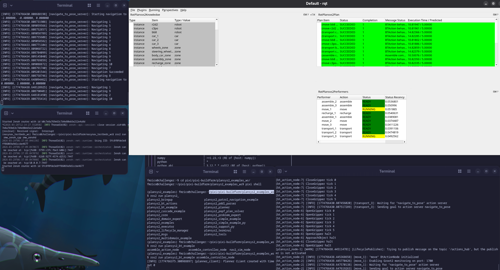

# PlanSys2 on ROS 2 kilted

This documentation covers two related workflows:

1. **For users**: how to set up a Pixi-based ROS workspace that consumes PlanSys2 binaries and builds your own code with `colcon`.
2. **For package creators**: how to build PlanSys2 packages in this repository (`ros-kilted/`) and publish them to prefix.dev.

Project website:

- https://plansys2.github.io/

Pixi background and common troubleshooting lives in:

- `irl-docs/pixi.md`

---

## 1) What is this?

PlanSys2 is a planning system for ROS 2.

In this repo we build PlanSys2-related ROS packages as Conda artifacts (`.conda`) and publish them to prefix.dev (channel `irl-kilted`).

---

## 2) For users: workspace with Pixi + colcon

This folder contains a ready-to-use workspace template:

- `irl-docs/plansys2/pixi.toml`
- `irl-docs/plansys2/activate.sh`

It is aligned with the workspace used in this repo (`plansys2_examples_ws/`).

### 2.1 Create a new workspace

Create a new folder and copy the template files:

```bash
mkdir -p ~/plansys2_examples_ws
cd ~/plansys2_examples_ws

cp /path/to/pixi-buildfarm/ros-kilted/irl-docs/plansys2/pixi.toml ./pixi.toml
cp /path/to/pixi-buildfarm/ros-kilted/irl-docs/plansys2/activate.sh ./activate.sh
chmod +x ./activate.sh
```

Then update the local file-based channel path if needed:

- `file:///.../ros-kilted/output`

Important: use the **channel root**, not `.../output/linux-64`. See `irl-docs/pixi.md`.

### 2.2 Install dependencies

```bash
pixi install
```

### 2.3 Build your ROS workspace

Add your ROS packages under `src/` and build:

```bash
pixi run build
```

After the first build, the activation script will source `install/setup.bash` automatically.

### 2.4 Running PlanSys2

Exact commands depend on your workspace and launch files.

As a rule of thumb:

- Use `ros2 launch ...` for bringing up the system.
- Use `ros2 run ...` for individual nodes.

### 2.5 Worked example: `plansys2_bt_example` with Nav2 simulation

This is the workflow we used to add content, build, and run a PlanSys2 example.

Repository and branch:

- https://github.com/PlanSys2/ros2_planning_system_examples.git (branch: `kilted`)

Fetch the workspace content:

```bash
cd ~/plansys2_examples_ws
mkdir -p src

git clone -b kilted https://github.com/PlanSys2/ros2_planning_system_examples.git src/ros2_planning_system_examples
```

Build:

```bash
cd ~/plansys2_examples_ws
pixi run build
```

Run (multiple terminals):

1) Open each terminal and enter the environment:

```bash
cd ~/plansys2_examples_ws
pixi shell
```

2) Terminal A (Zenoh daemon, start this before any nodes):

```bash
ros2 run rmw_zenoh_cpp rmw_zenohd
```

3) Terminal B (Nav2 simulator used by the example):

```bash
ros2 run plansys2_bt_example nav2_sim_node
```

Alternatively, you can run a full Nav2 stack on a real robot (and skip `nav2_sim_node`).

4) Terminal C (launch PlanSys2 with the Behavior Tree patrolling example config/actions):

```bash
ros2 launch plansys2_bt_example plansys2_bt_example_launch.py
```

5) Terminal D (PlanSys2 controller for the example):

```bash
ros2 run plansys2_bt_example assemble_controller_node
```

6) Optional: Terminal E (RQt GUI, add the PlanSys2 visualization plugins):

```bash
rqt_gui
```

Screenshot:



---

## 3) For package creators: buildfarm in this repo

All buildfarm work happens under `ros-kilted/`.

### 3.1 Quick path (Pixi tasks)

```bash
cd ros-kilted
pixi install
pixi run plansys2-all
```

Notes:

- The PlanSys2 tasks are designed for `linux-64` by default.
- The workflow builds `ros-kilted-popf` early and indexes `./output` so dependent recipes can resolve.

### 3.2 How the subset is defined

The PlanSys2 subset is defined in:

- `ros-kilted/plansys2_subset/vinca.yaml`

It selects:

- All `plansys2_*` packages
- `popf`
- `rclcpp_cascade_lifecycle`

### 3.3 Manual flow (if you need it)

Generate recipes:

```bash
cd ros-kilted
pixi run remove-recipes
pixi run -v vinca -d ./plansys2_subset --platform linux-64 -m
```

Build `.conda` artifacts:

```bash
pixi run rattler-build build \
  --recipe-dir ./recipes \
  --target-platform linux-64 \
  -m ./conda_build_config.yaml \
  -c https://prefix.dev/robostack-kilted \
  -c https://repo.prefix.dev/conda-forge \
  --skip-existing
```

Index the local channel:

```bash
pixi run rattler-index fs ./output --force
```

### 3.4 Upload to prefix.dev

Typical upload to `irl-kilted`:

```bash
cd ros-kilted
export PREFIX_API_KEY="..."

pixi run rattler-build upload prefix \
  --channel irl-kilted \
  --force \
  output/linux-64/*.conda
```

If consumers can't see newly-published packages, clear repodata cache on the consumer side:

```bash
pixi clean cache --repodata -y
```
